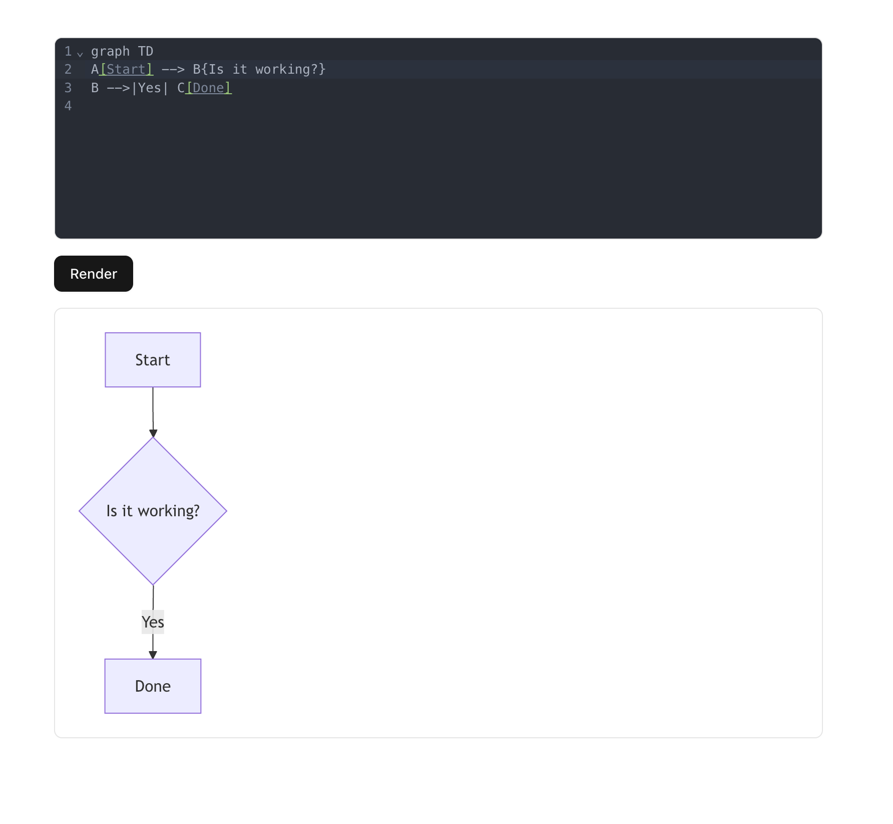
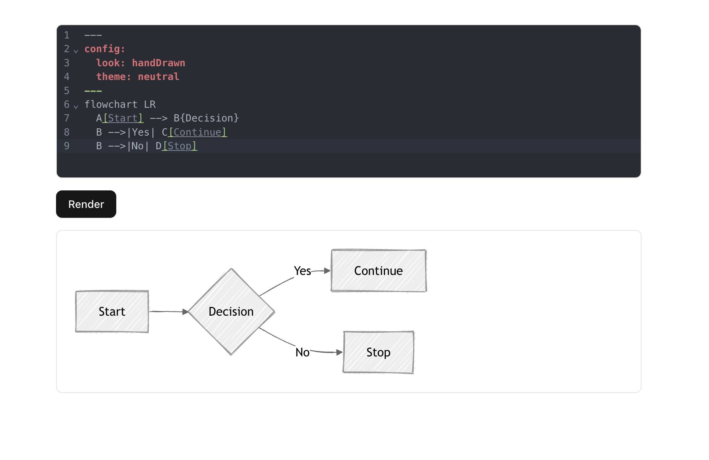
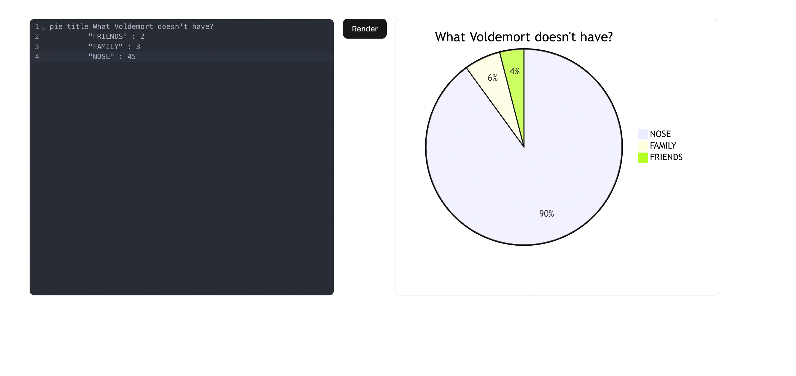
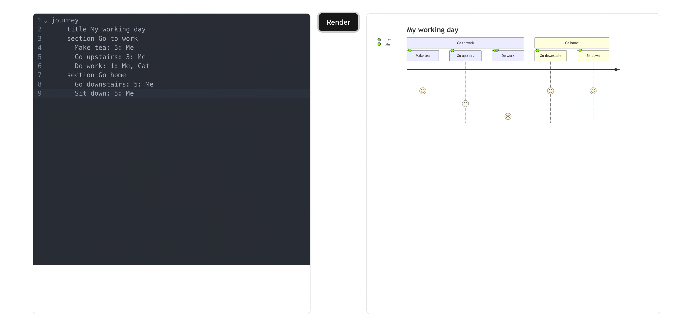
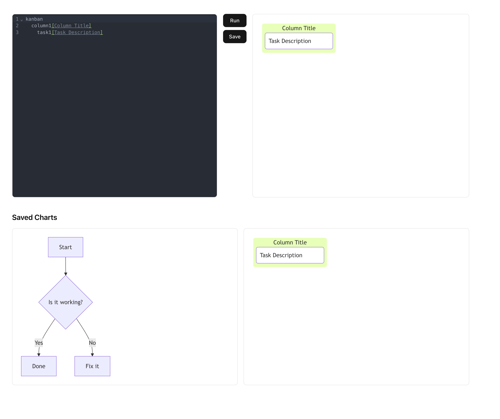
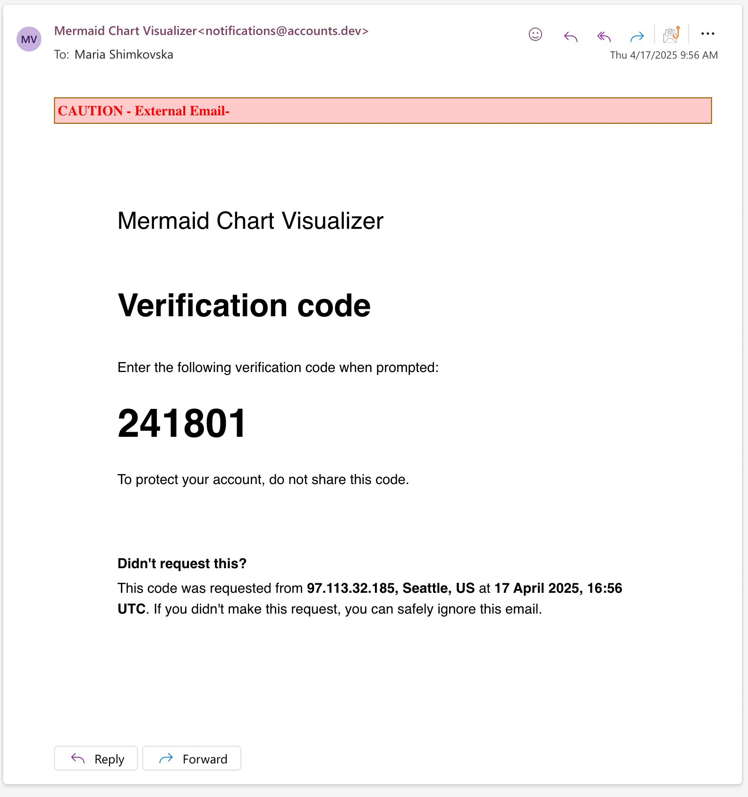

This is a [Next.js](https://nextjs.org) project bootstrapped with [`create-next-app`](https://nextjs.org/docs/app/api-reference/cli/create-next-app).

I am building a MermaidJS editor tool, and adding authentication using Clerk to it. 

Connecting it to Supabase for more user management.

Comparing it later to SuperTokens by building it with SuperTokens too and Supabase too. 











## Getting Started

First, run the development server:

```bash
npm run dev
# or
yarn dev
# or
pnpm dev
# or
bun dev
```

Open [http://localhost:3000](http://localhost:3000) with your browser to see the result.

## Development 

### 🔧 Core Tools & Libraries

* Next.js 
* ShadCN for the UI
* Mermaid.js library for the diagrams parsing.


Using clerk, after set up, and using email authentication the email arrives pretty fast and also you for a code like so: 


